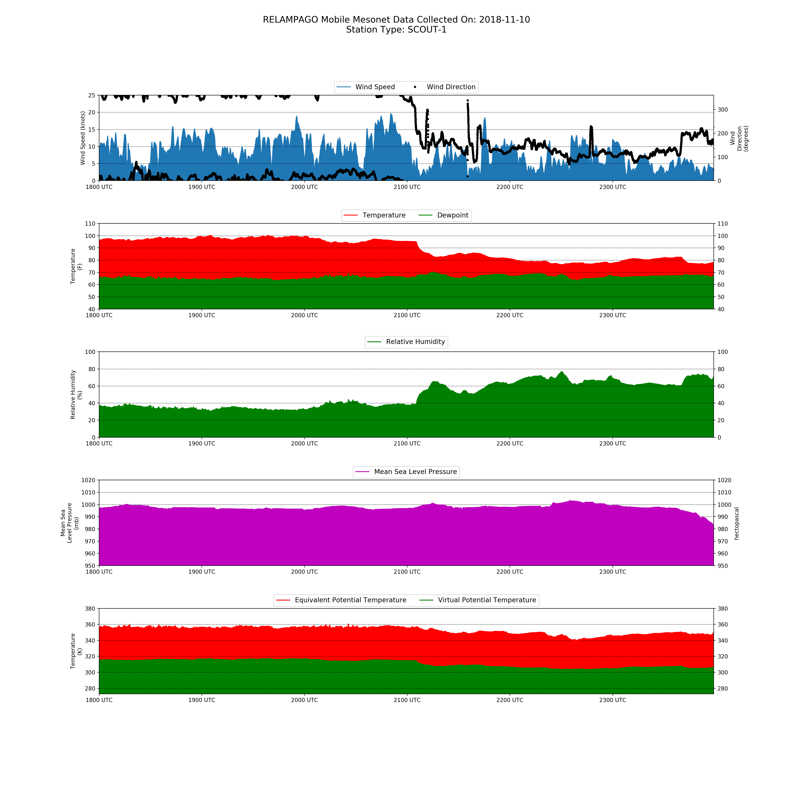
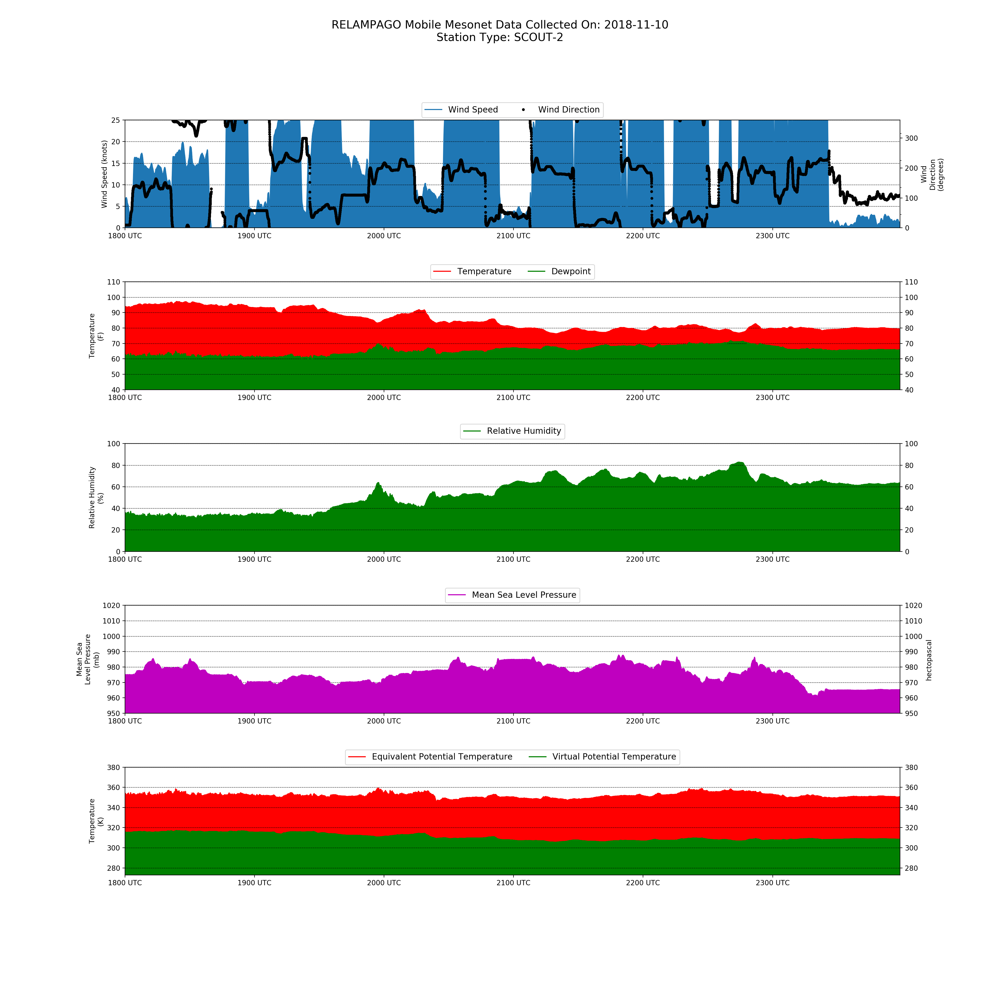
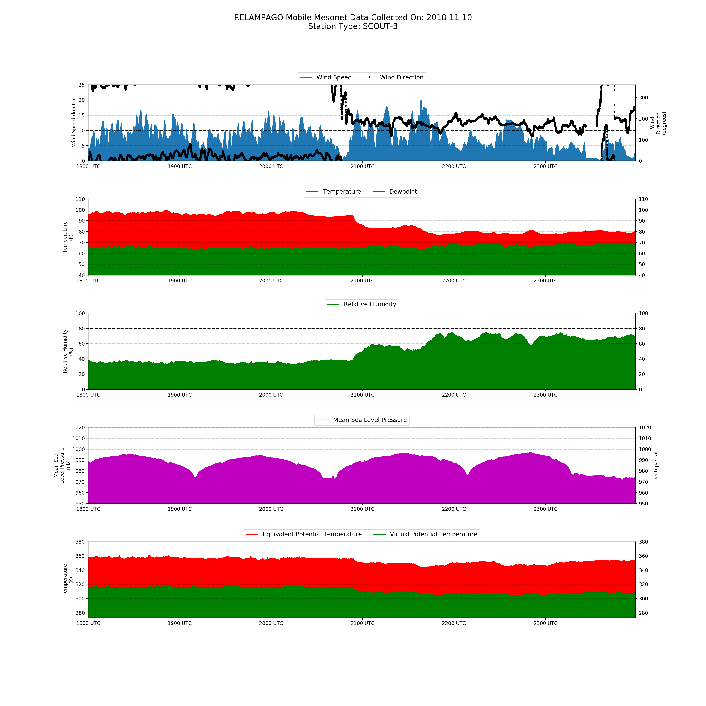

# Surface Observations

*Scout 1 observation collected by CSWR Mobile Mesonet*

*Scout 2 observation collected by CSWR Mobile Mesonet*

*Scout 3 observation collected by CSWR Mobile Mesonet*

# Satellite Observations

# Relevant Papers
**[Paloma et. al 2019](paloma_et_al.md)**
- Observational Study of the Thermodynamics and Morphological Characteristics of a Midlatitude Continental Cold Pool Event
- Utilized surface stations, radar, and soundings
